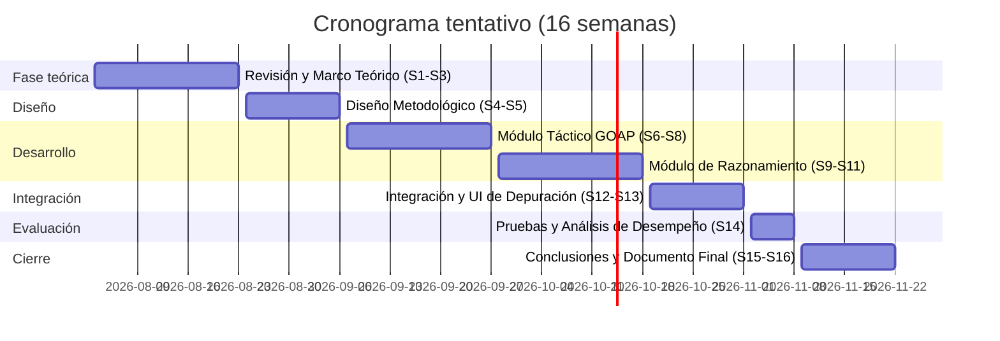

# Agente Híbrido para NPCs: Integración de Deliberación Semántica mediante Modelos de Lenguaje Compactos y Ejecución Táctica (GOAP) en Entornos 3D

**Universidad Autónoma de Nuevo León**
**Facultad de Ingeniería Mecánica y Eléctrica**

- **Alumno:** Nicolás Mauricio Cantú Salinas
- **Matrícula:** 2013576
- **Asesor:** Raymundo Said Samora Pequeño
- **Fecha:** 29/Mayo/2026

## Antecedentes

El diseño de inteligencia artificial para Personajes No Jugables (NPCs) se ha basado tradicionalmente en Máquinas de Estados Finitos (FSM) y Árboles de Comportamiento. Estas estructuras son computacionalmente eficientes, pero presentan limitaciones documentadas frente a situaciones no contempladas en su diseño, fenómeno conocido como "maldición del scripting" [1].

Para mitigar esta rigidez, se introdujeron esquemas basados en Utilidad (Utility AI), donde las decisiones del agente dejan de depender de transiciones predefinidas y se determinan mediante funciones de utilidad ponderadas que evalúan el estado del entorno y asignan una puntuación a cada acción posible [1]. Este enfoque incrementó la flexibilidad del comportamiento, pero el razonamiento del agente continuó dependiendo de reglas y parámetros definidos manualmente por el diseñador. En paralelo, la arquitectura Comme il Faut (CiF) introdujo el tratamiento de las interacciones sociales como intercambios que modifican un estado relacional persistente entre agentes, evidenciando la necesidad de representar contexto social más allá del estado físico inmediato [2].

La limitación común a estos enfoques es que el razonamiento simbólico complejo, como la interpretación de normas sociales, la justificación de acciones o la adaptación a situaciones imprevistas, resulta costoso de representar mediante reglas manuales. Esta brecha motivó la incorporación de Modelos de Lenguaje Extensos (LLMs) como componente de razonamiento de alto nivel. Trabajos como los Generative Agents y el marco CRSEC (Creación, Propagación, Evaluación y Cumplimiento) reportan que los modelos de lenguaje permiten dotar a los agentes de capacidades de razonamiento sobre normas sociales, evaluación de conflictos y propagación de información en sistemas multiagente [3].

Sin embargo, el costo computacional de ejecutar LLMs en tiempo real hizo necesario un nuevo paso evolutivo: las arquitecturas híbridas, que separan el control en dos niveles. Un componente basado en modelos de lenguaje se encarga de la deliberación semántica de alto nivel, mientras que un planificador clásico como GOAP (Goal-Oriented Action Planning) gestiona la ejecución táctica dentro del motor de juego [4]. En este enfoque cobra relevancia el uso de modelos de lenguaje compactos, optimizados para ejecución bajo restricciones de latencia, como una vía para hacer viable la integración en entornos interactivos.

Por otra parte, es importante reconocer que el comportamiento de un agente autónomo es multifactorial: sus decisiones son influidas simultáneamente por interacciones con el entorno físico, por su estado interno fisiológico (necesidades como hambre, fatiga o seguridad) y por sus interacciones sociales con otros agentes. Cada uno de estos factores constituye un dominio de estudio amplio por sí mismo. Por razones de alcance y viabilidad dentro del periodo del proyecto, este trabajo se acota exclusivamente al componente de interacciones sociales, asumiendo representaciones simplificadas del entorno físico y del estado interno del agente.

## Definición del Problema

El diseño de NPCs con capacidad de razonamiento social en entornos 3D enfrenta una tensión técnica directa entre dos enfoques disponibles. Por un lado, los sistemas basados en planificación clásica como GOAP o Utility AI operan eficientemente en tiempo real y respetan las restricciones físicas del motor de juego, pero el razonamiento sobre normas sociales, justificación de comportamientos o adaptación a situaciones imprevistas debe ser codificado manualmente, lo que limita la flexibilidad del agente. Por otro lado, los Modelos de Lenguaje Extensos ofrecen razonamiento simbólico flexible, pero su inferencia es costosa en tiempo y recursos, y al carecer de anclaje espacial pueden generar planes lógicamente coherentes pero inviables dentro del motor.

Frente a este escenario, en el presente proyecto se implementará un agente híbrido que combine ambos enfoques en un mismo NPC: un módulo de razonamiento basado en un modelo de lenguaje compacto, encargado de la deliberación social, y un módulo de ejecución basado en GOAP, encargado de traducir esa deliberación en acciones ejecutables dentro del entorno 3D. La interacción entre ambos módulos se acota a un único agente operando en una escena controlada de Unity, con un conjunto reducido de acciones disponibles y situaciones sociales predefinidas.

## Objetivo General

Implementar un agente inteligente híbrido dentro de un entorno 3D acotado, que combine un componente de deliberación basado en un modelo de lenguaje compacto con capacidad de inferencia bajo restricciones de latencia y un componente de ejecución táctica basado en GOAP, con el fin de explorar la viabilidad de este tipo de integración para la simulación de comportamientos sociales en NPCs.

## Objetivos Particulares

1. **Diseñar el módulo de razonamiento del agente**, integrando un modelo de lenguaje compacto optimizado para latencia que permita al agente evaluar situaciones sociales básicas y generar intenciones de alto nivel a partir de su estado y contexto.
2. **Implementar el módulo de ejecución táctica en Unity** mediante un planificador GOAP que reciba las intenciones del módulo de razonamiento y las traduzca en secuencias de acciones ejecutables dentro de las restricciones del entorno 3D.
3. **Validar el funcionamiento del agente en un prototipo acotado** que incluya una interfaz de depuración visual para inspeccionar el razonamiento y las decisiones del agente, y documentar el desempeño observado en términos de latencia y coherencia de las acciones.

## Contribución del Estudiante

En este proyecto se realizará el diseño e implementación de un agente inteligente híbrido dentro del motor Unity 3D, integrando un módulo de razonamiento basado en un modelo de lenguaje compacto con un módulo de ejecución táctica basado en GOAP. Se construirá un entorno de prueba acotado donde el agente pueda operar bajo este esquema, y se desarrollará una interfaz de depuración visual que permita observar en tiempo real las decisiones del agente, su estado interno y la justificación de las acciones ejecutadas. Adicionalmente, se documentará el comportamiento observado del agente y el costo computacional asociado a la ejecución del modelo de lenguaje en conjunto con el planificador, con el fin de aportar evidencia empírica sobre la viabilidad técnica de este tipo de integración.

## Cronograma tentativo

## Referencias

- [1] Jacinto, J. A. B., Sanig, M. K. S., Namuag, S. G., & Olmoguez II, E. D. (2024). Development of Autonomous NPC Worker Agents through a Modular GOAP Architecture in 3D Simulations. *International Journal on Science and Technology (IJSAT)*.
- [2] Mitchell, K., & McCoy, J. (2025). A Method to the Machine: An Architecture for Argument-Driven, Dynamic Character Performance. *AAAI Publications*.
- [3] Ren, S., Cui, Z., Song, R., Wang, Z., & Hu, S. (2024). Emergence of Social Norms in Generative Agent Societies: Principles and Architecture. *Proceedings of the International Joint Conference on Artificial Intelligence (IJCAI)*.
- [4] Puerta-Merino, I., & Sabater-Mir, J. (2025). LLM Reasoner and Automated Planner: A new NPC approach. *arXiv preprint arXiv:2501.10106v1*.
- [5] Robison, E., Viglione, M., Zubek, R., & Horswill, I. (2021). AI Design Lessons for Social Modeling at Scale. *Proceedings of the Seventeenth AAAI Conference on Artificial Intelligence and Interactive Digital Entertainment (AIIDE)*, 213–219.
- [6] von der Pütten, A. M., et al. (2023). Emotion Contagion in Agent-based Simulations of Crowds: A Systematic Review. *Autonomous Agents and Multi-Agent Systems*, 37(6).
- [7] Kang, H., Zhang, Q., Cai, H., Xu, W., Du, Y., & Weissman, T. (2024). Win Fast or Lose Slow: Balancing Speed and Accuracy in Latency-Sensitive Decisions of LLMs. *arXiv preprint arXiv:2505.19481*.
